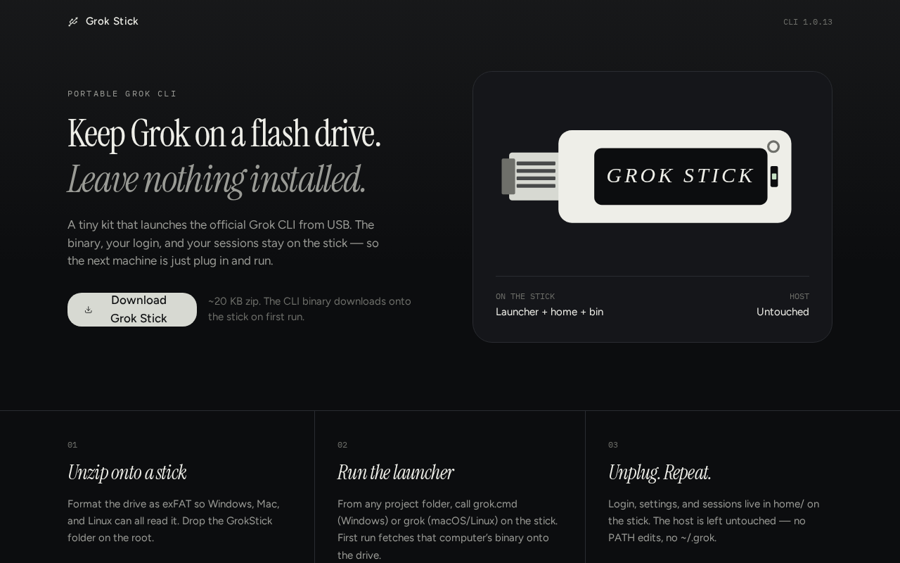

# Grok Stick

**Keep Grok on a flash drive. Leave nothing installed.**

A portable kit that launches the official [Grok CLI](https://x.ai/cli) from USB. The binary, your login, and your sessions stay on the stick — so the next machine is just plug in and run.



This repository is the landing page and kit generator. The downloadable zip is a thin wrapper around the official CLI. It does not modify the Grok binary.

## Why

- No host install — nothing written to `~/.grok`, Program Files, or `/usr/local`
- Login travels with you — `home/auth.json` or an API key on the drive
- One stick, six platforms — Windows, macOS, and Linux (x64 + ARM64)
- Session-only PATH helpers — unplug and the computer is as you found it

## Quick start

1. Open the site (or run this app locally) and download **GrokStick.zip**.
2. Format a USB drive as **exFAT** so Windows, macOS, and Linux can all read it.
3. Copy the `GrokStick` folder onto the root of the drive.
4. From any project folder, run the launcher on the stick:

```bash
# Windows
E:\\GrokStick\\grok.cmd

# macOS
/Volumes/USB/GrokStick/grok

# Linux
/media/$USER/USB/GrokStick/grok
```

First run fetches the official binary for *that* computer onto the stick (~100–160 MB). After that, the same OS/CPU starts instantly.

Optional, so this terminal can just type `grok`:

```bash
# PowerShell
. E:\\GrokStick\\env.ps1

# macOS / Linux
source /Volumes/USB/GrokStick/env.sh
```

Those helpers last only for the current session.

## What’s in the kit

```text
GrokStick/
  grok / grok.cmd          launchers
  fetch-all.sh / .cmd      preload every OS
  env.sh / .ps1 / .cmd     session PATH only
  bin/                     official binaries land here
  home/                    login, settings, sessions
  README.txt               keep this next to the launchers
```

Preload every platform while you have a fast connection:

```bash
# Windows
fetch-all.cmd

# macOS / Linux
./fetch-all.sh
```

## Sign in

- First launch opens a browser. The session is saved as `home/auth.json` on the stick (~7 days).
- Or paste an API key from [console.x.ai](https://console.x.ai) into `home/api-key`.

Treat a lost stick like a lost password manager: sign out on grok.com if you used browser login, and rotate the API key.

## Develop the site

This app is a TanStack Start + Vite + React 19 site that generates `GrokStick.zip` in the browser.

```bash
npm install
npm run dev
```

Useful scripts:

| Script | What it does |
| --- | --- |
| `npm run dev` | Dev server |
| `npm run build` | Production build |
| `npm run typecheck` | TypeScript |
| `npm run lint` | ESLint |
| `npm run test` | Unit tests |
| `npm run format` | Prettier |

Requires **Node.js 22+**.

> Grok App Builder leftovers (`.grok/`, `AGENTS.md`, `startup.sh`, `public/__grok/`) are platform scaffolding. Leave them if you still remix this project inside Grok; they are not required to run the site on your own machine.

## Security notes

- The launchers set `GROK_HOME` to the stick and disable the official auto-updater so the host profile stays clean.
- Binaries come from [x.ai/cli](https://x.ai/cli). On first run macOS Gatekeeper or Windows SmartScreen may warn because the copy is unsigned as a portable file — Open Anyway / Run anyway after you have verified the source.
- This kit is a portable wrapper, not an offline model. Grok still needs internet to talk to xAI.

See [SECURITY.md](SECURITY.md) to report a vulnerability.

## License

MIT. See [LICENSE](LICENSE).

Grok and the Grok CLI are trademarks of xAI. This project is an independent portable wrapper and is not affiliated with or endorsed by xAI.
